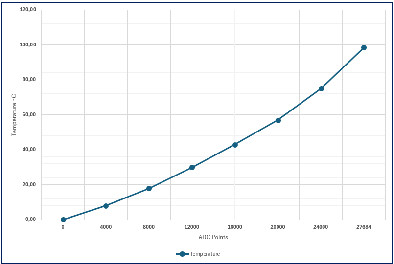
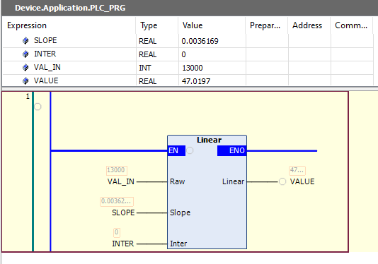

# From 2-point scaling to (easy) Linear Regression

## Let's keep it short and simple.


Suppose we have a temperature transducer connected to our analog module, regardless of whether it's voltage, current, or something else.

We know, from the datasheet, that the temperature range of the transducer is 0°C to 100°C, and that the corresponding range of points read by the analog board is 0 to 27864.

What comes out of our analog module is often called the "Raw Value" because it has no units; they are ADC points.

Our goal is to instantly know the temperature value (as a real number) from the raw value we read. In other words, if we read **13000** from the analog module, what temperature (in °C) is our transducer detecting? We then need to convert this value.

## Two-Point Method (Min-Max)

Virtually all PLCs have system functions capable of performing this conversion; Siemens has the **NORM_X** / **SCALE_X** pair, Bechkoff has **F_SCALE**, Rockwell has **SCP** and **SCL**, and so on, including various variations.

All these functions use the straight-line method constructed with two points representing the minimum and maximum ranges.

In our case, point **P1** (min) is the pair (0, 0), while **P2** (max) is the pair (27684, 100.00).

In practice this is the line built:


The process is very simple. Our functions require (at least) three input values: the two points, min and max, that they use to construct the line, and the raw value to convert.

The raw value will be used as "X" in the line to determine the output value "Y".

Likely:


## Example using NORM_X and SCALE_X

I'm using this example because it's the most complex, as the conversion occurs in two steps: first we normalize the value and then we scale it. Other functions, like Beckhoff F_Scale, do it all in one step.

**NORM_X** takes the raw value of the analog input and transforms it from an integer into a real number, that is, a number into the normalized range between 0.0 and 1.0.

**SCALE_X** transforms the dimensionless number (0.0 - 1.0) into an engineering-unit real value in the range min - max passed to the function.

So, taking the values from our previous example, we will write something like this:


Ultimately, even though we use two functions, the key parameters are always the points (ADC_MIN, TEMP_MIN) and (ADC_MAX, TEMP_MAX). The normalized value is usually a temporary variable that is often not used.

This is the prototype of Beckhoff's F_Scale


Additionally, the output value is automatically trimmed if it goes out of range.


## Problem: What if our transducer isn't linear?

The method we've seen uses only two points and assumes our transducer is perfectly linear, meaning that all points (Raw, Value) lie on the line we've constructed.

Suppose we have a transducer that behaves differently, like this one.



Its trend is clearly not linear. What happens when we construct the min-max line?


We notice that the values computed in the center of the band - **which is often the one we're most interested in** - have too high an error for our tastes.

If we adjust our min-max points to minimize the errors, we might experience side effects, because some functions trim the output values based on the min-max, so we'd get even worse performance outside our range of interest (and besides, imho, it's a really ugly method).

We can proceed in many ways, depending on our numerical proficiency. For simplicity's sake, let's say we prefer to continue using the straight-line method because it's simple and fast, but in this case, the straight line **needs to be improved**.

Essentially, given a set of points, we need a straight line that can best approximate the behavior of our sensor, like the green line in the figure.


To construct this line, the **Ordinary Least Squares** (OLS) method is used, which is a linear regression technique.

In practice, the resulting line must be the one that minimizes the sum of the squared distances (i.e., the errors) between the acquired samples and the line itself.

I promised you little math, so I won't go into details, there is a huge literature, what we need is to **understand how to use this method in the simplest way possible**, maybe even simpler than NORM_X/SCALE_X.

## Linear regression

The general equation of a straight line is **y = mx + q**, where 'm' represents the **slope** (or gradient) of the line, and 'q' represents the y-**intercept** (the point where the line crosses the y-axis). This is known as the slope-intercept form.

The equation y = mx + q allows you to find any y-coordinate on the line if you know the corresponding x-coordinate and the values of m and q.


In our case, X is represented by the raw value of the analog module and Y is the associated analog result.

So, constructing our line means identifying the two constants, **Slope** and **Intercept** starting from a set of observed points.

The method isn't particularly difficult, but it's cumbersome to use in the field, using only pen, paper, and a calculator.

So I created the Excel file that you find here, which performs this calculation automatically. Simply enter the pairs of acquired values, and the spreadsheet will return the slope and intercept values very easily.

With these two constants, we can convert our values directly to ST/SCL with the formula

```ST
Value := Raw * Slope + Intercept;
```

Or you can use a very simple function, which we will see now, which will allow you to manage this conversion directly in Ladder.

To recap:


This is the FC **Linear** (SCL TIA Portal):


In action:


The same, in portable ST:

```cpp
FUNCTION Linear : REAL
VAR_INPUT
    Raw   : INT;   (* Raw sensor value *)
    Slope : REAL;  (* Slope *)
    Inter : REAL;  (* Intercept *)
END_VAR
    Linear := Raw * Slope + Inter;
END_FUNCTION
```
Which, as expected, behaves in the same way (Codesys here)



> Note:
> if your range is 0..65535 you can change Raw type to **UINT** (don't use word).


## Initial Commissioning

During initial commissioning, we don't yet have the values available, but we can still use this method, using the datasheet values, just as we do for standard two-point functions:


## Not only PLC

This method is general enough to be used in any context where an analog-to-digital converter (ADC) is present: PC-based automation, embedded systems, etc.

Obviously, in these systems you will not use an analog-to-digital converter, but simply the conversion formula in any language.

## The Excel Sheet

It contains no macros or scripts of any kind, so you can use it in any context.

The sheet accepts up to 64 value pairs, but this limit can be easily increased by modifying the formula in cell E4 (which is the only existing formula).

Leave unused cells blank; I made sure the formula uses only non-blank value pairs.

### Localization

Unfortunately, some Excel functions are localized, so I've included their translations for these languages in the spreadsheet:

* **Italian**
* **English**
* **German**
* **French**
* **Spanish**


Just copy the formula (without the leading quote ' ) into the cell **E4**.

> Note: I haven't had the opportunity to test Excel in all its languages; I only have the Italian version. I relied on A.I. to translate the formulas. If you encounter any problems, please let me know so I can fix them.

Excel Online 365 appears to be able to automatically translate formulas. However, the idea is that this spreadsheet can be used on a laptop connected to the plant without an internet connection.